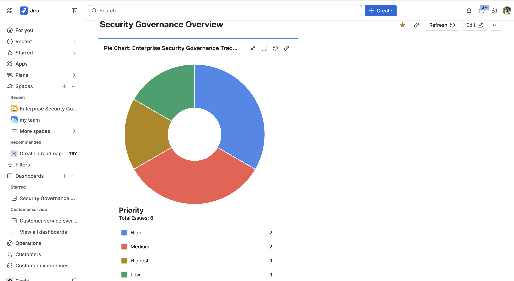
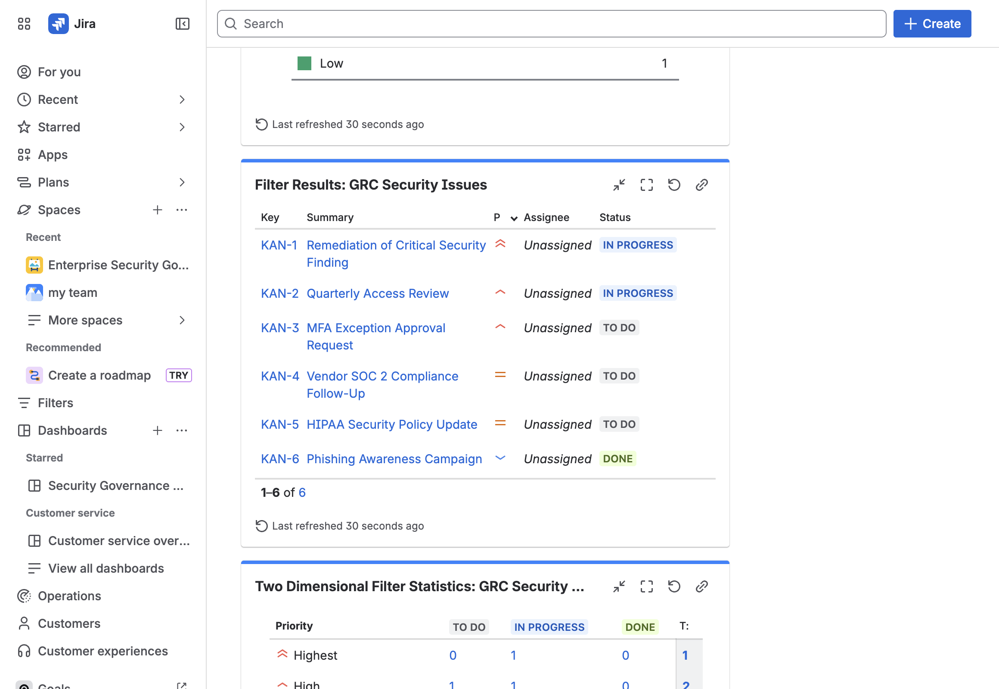
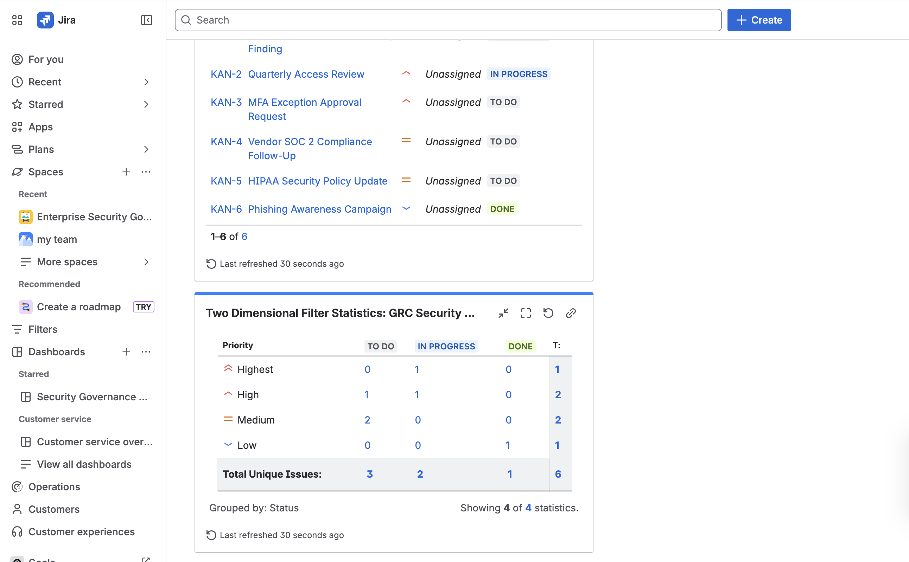

# 🔐 GRC Security Governance Dashboard (Jira)

## Overview
This project demonstrates the design and implementation of a Governance, Risk, and Compliance (GRC) workflow using Jira to simulate real-world cybersecurity operations.

It models how security teams track, prioritize, and report on:
- Vulnerability remediation  
- Access control reviews (IAM)  
- MFA exception handling  
- Vendor risk (SOC 2 compliance)  
- Regulatory compliance (HIPAA)  
- Security awareness initiatives  

---

## 🏗️ Project Design

The system was built using a Kanban-based workflow to represent active security operations:

### Workflow Stages
- To Do  
- In Progress  
- Done  

### Key Design Decisions
- Priority-based risk classification (Critical → Low)  
- Label-based categorization (IAM, vendor risk, compliance, remediation)  
- Realistic GRC ticket scenarios and lifecycle progression  

---

## 📊 Dashboard & Reporting

The dashboard provides visibility into security operations through:

### 🔹 Priority Distribution
Visualizes risk concentration across all tracked issues to support prioritization decisions.

### 🔹 Issue Tracking (Filter Results)
Displays active and completed work, enabling operational monitoring of remediation and compliance activities.

### 🔹 Priority vs Status Analysis
Highlights workflow bottlenecks and shows how high-risk issues progress through the lifecycle.

---

## 🎯 Use Case Simulation

This dashboard reflects how a security or GRC team would:

- Track remediation of critical findings  
- Perform periodic access reviews  
- Evaluate and approve risk exceptions  
- Monitor vendor compliance requirements  
- Maintain regulatory security policies  
- Run organization-wide security awareness campaigns  

---

## 🧠 Skills Demonstrated

- Governance, Risk, and Compliance (GRC) concepts  
- Security operations workflow design  
- Risk prioritization and classification  
- Jira project and dashboard configuration  
- Data visualization for security reporting  
- Analytical thinking in security operations  

---

## 📸 Screenshots

### Priority Distribution

### Issue Tracker

### Priority vs Status Analysis

---

## 💡 Why This Matters

This project demonstrates how Jira can be used to support structured cybersecurity governance and operational visibility, not just basic task tracking.

It reflects how security teams prioritize risk, manage remediation efforts, and communicate status through reporting and dashboards.
