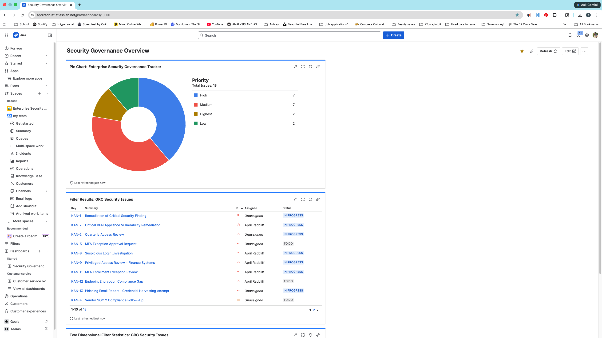
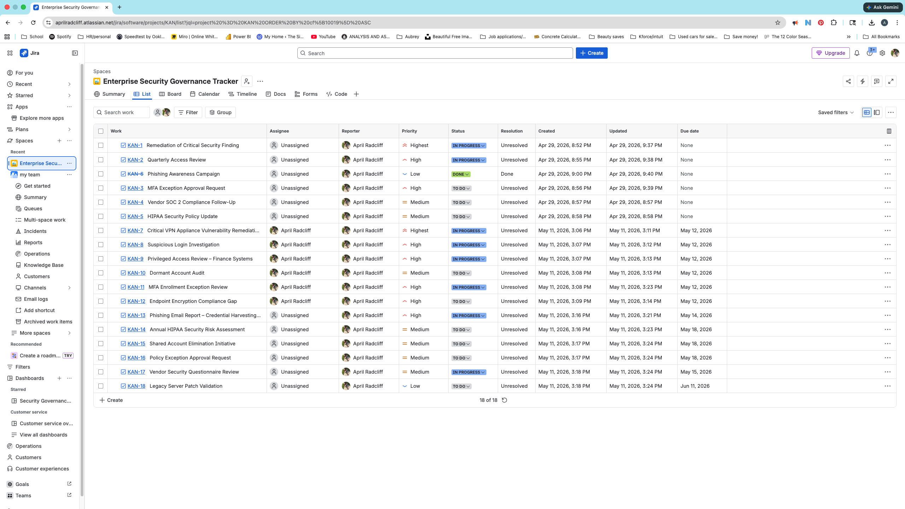
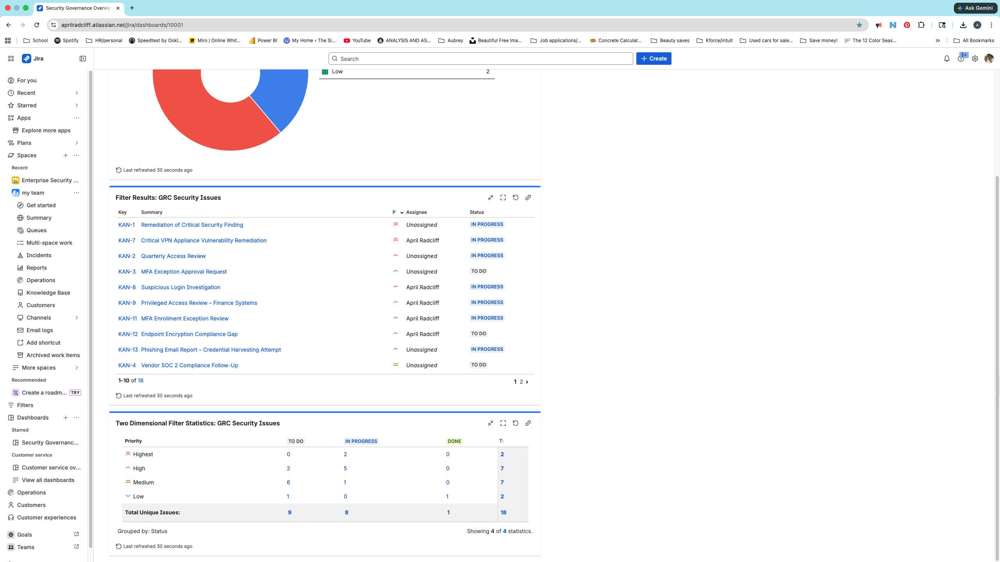
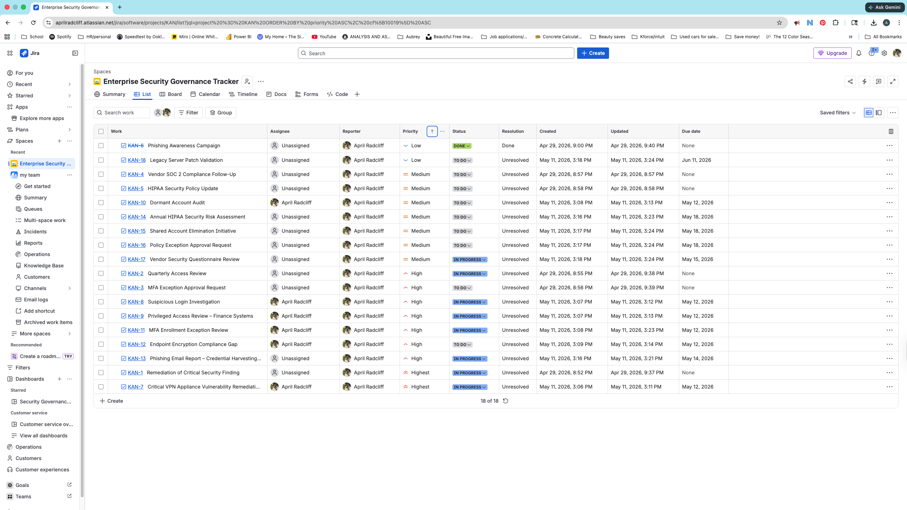

# 🔐 Enterprise Security Governance Tracker (Jira)

## 📌 Overview

This project simulates an enterprise cybersecurity governance and operational security tracking environment using Jira.

The environment was designed to model how a mid-sized healthcare organization could manage vulnerability remediation, IAM governance, security investigations, compliance activities, vendor risk management, and operational security workflows within a centralized platform aligned to HIPAA and NIST-oriented security practices.

Rather than functioning as a simple ticketing demonstration, this project was intentionally structured to simulate realistic governance and security operations coordination activities commonly performed within enterprise cybersecurity environments.

---

# 🎯 Project Objectives

* Centralize governance and operational security tracking
* Improve visibility into remediation and security activities
* Model risk prioritization and workflow management
* Simulate compliance and audit-related coordination
* Demonstrate practical cybersecurity workflow organization

---

# 🛡️ Simulated Security Functions

## Vulnerability Management

* Critical vulnerability remediation tracking
* Legacy system patch validation
* Endpoint encryption compliance monitoring
* Risk prioritization and remediation coordination

## Identity & Access Management (IAM)

* Privileged access reviews
* Dormant account audits
* MFA exception governance
* Shared account elimination initiatives

## Security Operations Coordination

* Suspicious login investigations
* Phishing incident tracking
* Security remediation coordination
* Operational workflow management

## Governance, Risk & Compliance (GRC)

* HIPAA security risk assessments
* Policy exception reviews
* Vendor security questionnaire reviews
* Compliance tracking workflows

---

# 📊 Dashboard & Reporting Features

The Jira dashboards were configured to simulate enterprise operational visibility through:

* Priority distribution reporting
* Issue status tracking
* Workflow monitoring
* Security operations coordination visibility
* Governance activity reporting
* Risk severity analysis

---

# 🧠 Skills Demonstrated

* Governance, Risk & Compliance (GRC)
* Vulnerability Management
* Security Workflow Coordination
* Incident Tracking
* Identity & Access Management (IAM)
* Risk Prioritization
* Security Operations Concepts
* Jira Dashboard Reporting
* Compliance Coordination
* Operational Security Documentation
* Analytical Thinking in Cybersecurity Operations

---

# 📂 Example Governance & Security Workflows

The project includes simulated enterprise cybersecurity activities such as:

* Critical VPN appliance vulnerability remediation
* Suspicious login investigations
* MFA exception reviews
* Vendor risk management
* HIPAA compliance activities
* Privileged access reviews
* Endpoint encryption compliance tracking
* Policy exception governance
* Phishing incident coordination

---

📸 Dashboard Visuals

### Security Governance Dashboard

### Governance & Security Operations Tracking

### Priority vs Status Analysis

### Security Workflow Board

### Example Security Investigation Workflow

---

# 💡 Why This Matters

This project demonstrates how Jira can be used beyond basic task management to support structured cybersecurity governance, operational visibility, and security workflow coordination.

It reflects how security teams:

* Prioritize risk based on impact and urgency
* Track remediation progress across multiple issue types
* Coordinate governance and operational security activities
* Communicate status clearly to stakeholders
* Maintain accountability in compliance-driven environments

---

# 🏁 Outcome

This project provides a centralized view of governance and operational security workflows, enabling improved visibility into risk, remediation status, compliance activities, and security operations coordination.

It simulates the type of reporting, workflow management, and operational structure commonly used within enterprise GRC and cybersecurity teams.
